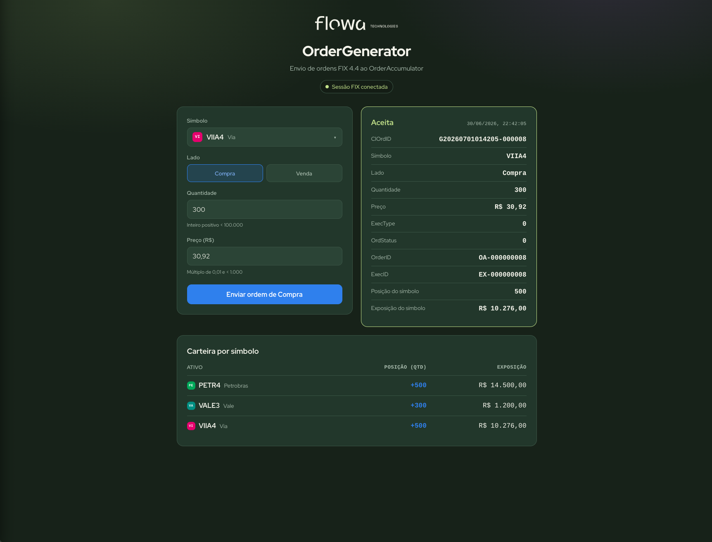
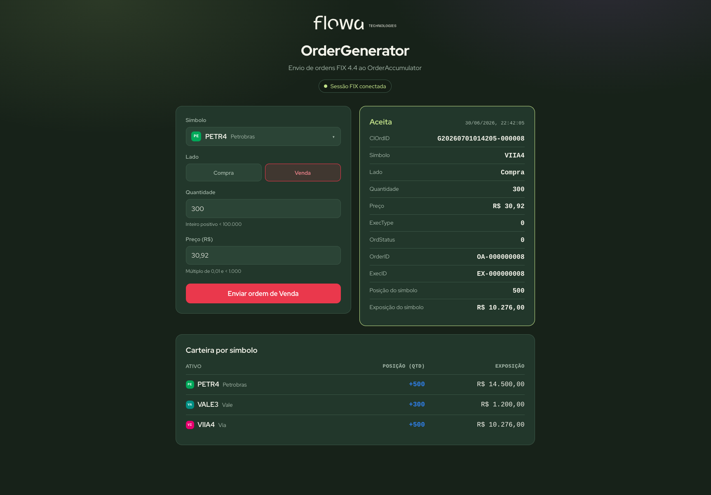
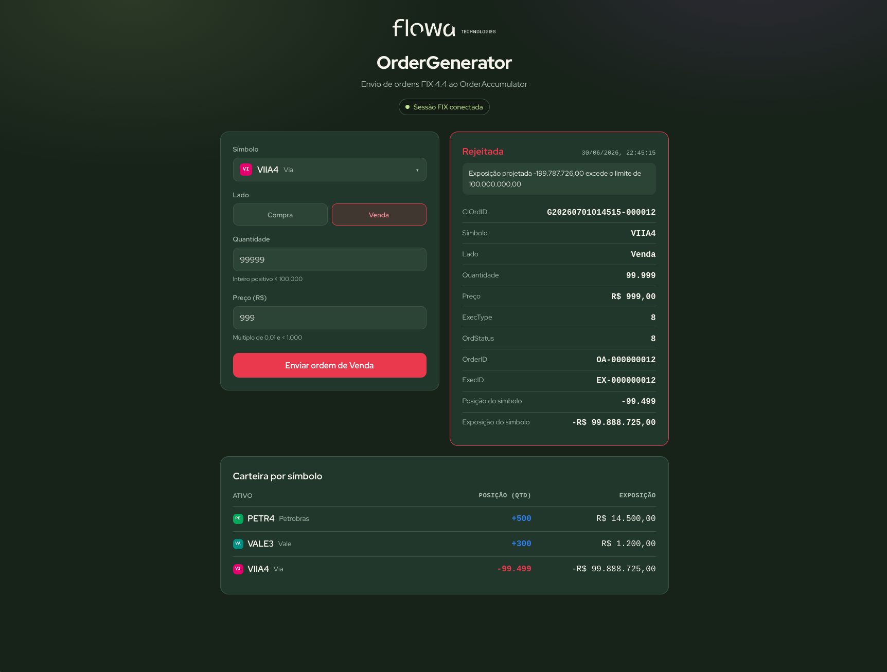
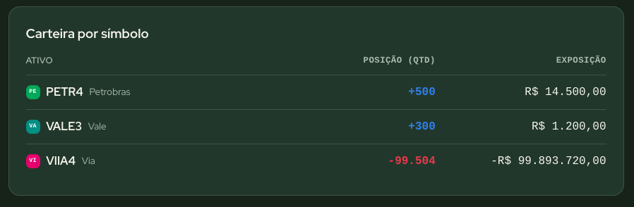

# Avaliação Flowa — OrderGenerator & OrderAccumulator (FIX 4.4)

Duas aplicações em **C# (.NET 10)** que se comunicam pelo protocolo **FIX 4.4** (via
[QuickFIX/n](https://quickfixn.org/)), com um frontend **React + Vite** para envio de
ordens e acompanhamento da exposição por símbolo.


> This is a challenge by [Coodesh](https://coodesh.com/)



---

## Sumário

- [Visão geral](#visão-geral)
- [Telas](#telas)
- [Tecnologias](#tecnologias)
- [Estrutura do projeto](#estrutura-do-projeto)
- [Regras de negócio](#regras-de-negócio)
- [Pré-requisitos](#pré-requisitos)
- [Como executar](#como-executar)
- [Testando a API diretamente](#testando-a-api-diretamente)
- [Endpoints da API](#endpoints-da-api)
- [O protocolo FIX no projeto](#o-protocolo-fix-no-projeto)
- [Arquitetura e decisões de projeto](#arquitetura-e-decisões-de-projeto)
- [Próximos passos](#próximos-passos)

---

## Visão geral

| Aplicação | Papel FIX | Responsabilidade |
|-----------|-----------|------------------|
| **OrderGenerator.Api** | *initiator* | Expõe uma API web + formulário (React) para criar ordens (`NewOrderSingle`) e apresentar a resposta. |
| **OrderAccumulator** | *acceptor* | Recebe as ordens, calcula a exposição financeira por símbolo e responde com `ExecutionReport` (New/Rejected). |

```
┌───────────────┐   HTTP/JSON    ┌──────────────────────┐   FIX 4.4 / TCP 5001   ┌────────────────────┐
│ React (Vite)  │ ─────────────▶ │  OrderGenerator.Api   │ ───NewOrderSingle────▶ │  OrderAccumulator   │
│  formulário   │ ◀───────────── │  (FIX initiator)      │ ◀──ExecutionReport──── │  (FIX acceptor)     │
└───────────────┘  OrderResult   └──────────────────────┘                        └────────────────────┘
```

O browser não fala FIX diretamente — o padrão é **browser ↔ HTTP ↔ gateway ↔ FIX**.
A `OrderGenerator.Api` é esse gateway: traduz HTTP em FIX e correlaciona, de forma
assíncrona, a resposta que chega do acumulador.

---

## Telas

**Ordem aceita** (`ExecType = New`) e **ordem rejeitada** por limite de exposição
(`ExecType = Rejected`, com o motivo retornado pelo acumulador):

| Aceita | Rejeitada |
|--------|-----------|
|  |  |

**Carteira por símbolo** — posição líquida (comprado/vendido) e exposição financeira,
consolidadas a partir do estado autoritativo do acumulador:



---

## Tecnologias

- **.NET 10** — OrderAccumulator (console + Generic Host) e OrderGenerator.Api (ASP.NET Core Minimal API).
- **QuickFIXn.Core + QuickFIXn.FIX44 1.14.1** — implementação FIX 4.4 e mensagens fortemente tipadas.
- **React + Vite + TypeScript** — frontend.
- **Protocolo FIX 4.4** — `NewOrderSingle` (35=D) e `ExecutionReport` (35=8).

---

## Estrutura do projeto

```
avaliacao-flowa/
├── AvaliacaoFlowa.sln
├── config/FIX44.xml                         # data dictionary FIX 4.4 (referência)
├── docs/images/                             # prints usados neste README
└── src/
    ├── OrderAccumulator/                     # console (acceptor FIX)
    │   ├── Domain/ExposureService.cs         # exposição + posição por símbolo (thread-safe)
    │   ├── Domain/SymbolCatalog.cs
    │   ├── Fix/AcceptorApplication.cs        # NewOrderSingle → ExecutionReport
    │   ├── Fix/FixCustomTags.cs              # tags 5001 (exposição) / 5002 (posição)
    │   ├── Fix/FixAcceptorHostedService.cs
    │   └── config/acceptor.cfg
    ├── OrderGenerator.Api/                    # ASP.NET Core Minimal API (initiator FIX)
    │   ├── Orders/OrderContracts.cs
    │   ├── Orders/OrderValidator.cs          # validação das regras de negócio
    │   ├── Fix/FixGateway.cs                 # envio + correlação ClOrdID→ExecutionReport + carteira
    │   ├── Fix/FixInitiatorHostedService.cs
    │   ├── Program.cs                        # endpoints /api/orders, /api/meta, /api/health, /api/portfolio
    │   └── config/initiator.cfg
    └── order-generator-web/                   # frontend React + Vite
        └── src/
            ├── App.tsx                        # formulário e composição
            ├── SymbolSelect.tsx / CompanyBadge.tsx / companies.ts
            ├── PortfolioPanel.tsx             # carteira por símbolo
            ├── ResultPanel.tsx               # ExecutionReport na tela
            └── api.ts                         # cliente HTTP (/api/*)
```

---

## Regras de negócio

- **Símbolos aceitos:** `PETR4`, `VALE3`, `VIIA4`.
- **Lado:** Compra (`Buy` / `54=1`) ou Venda (`Sell` / `54=2`).
- **Quantidade:** inteiro positivo `< 100.000`.
- **Preço:** decimal positivo, múltiplo de `0,01`, `< 1.000`.
- **Exposição financeira por símbolo** = Σ(preço × quantidade) das **compras** − Σ(preço × quantidade) das **vendas**.
- **Limite por símbolo:** `R$ 100.000.000`. Se uma ordem faria a exposição ultrapassar
  o limite **em valor absoluto**, ela é **rejeitada** (`ExecType = Rejected`) e **não**
  entra no cálculo. Caso contrário é **aceita** (`ExecType = New`) e passa a contar.

> **Exposição ≠ posição.** *Exposição* é um valor em **R$** (depende dos preços de cada
> negócio); *posição* é a **quantidade líquida** de ações. Comprar 1.000 a R$30 e vender
> 400 a R$31 deixa a posição em 600, mas a exposição em R$30.000 − R$12.400 = R$17.600.
> O enunciado pede exposição financeira — por isso o limite é em R$.

---

## Pré-requisitos

- **Com Docker (recomendado):** apenas **Docker** + **Docker Compose v2** (comando `docker compose`).
- **Sem Docker (execução local):** **.NET SDK 10** e **Node.js 18+** com **npm** (testado com Node 20).

---

## Como executar

### Opção 1 — Docker (recomendado)

Sobe os **três serviços** (acumulador, API e frontend) com um comando, sem instalar
.NET ou Node na máquina.

```bash
# 1. Clonar o repositório
git clone https://github.com/Elwilton/avaliacao-flowa
cd avaliacao-flowa

# 2. Subir tudo (builda as imagens na primeira vez)
docker compose up --build

# 3. Acessar a aplicação
#    http://localhost:8080

# 4. Encerrar (em outro terminal, ou Ctrl+C e depois:)
docker compose down
```

Pronto — abra **http://localhost:8080**, preencha o formulário e envie. O `ExecutionReport`
aparece ao lado e a carteira por símbolo é atualizada.

> No Docker, tudo passa pela **porta 8080** (o Nginx serve o front e faz *proxy* de
> `/api/*` para a API). O estado é em memória, então cada `up` começa com a carteira zerada.

Detalhes de como o Compose orquestra os serviços em [Como funciona o Compose](#como-funciona-o-compose).

### Opção 2 — Execução local (sem Docker)

Abra **três terminais** na raiz do projeto. Suba o acumulador primeiro (ele é o *acceptor*).

**1) OrderAccumulator (acceptor)**
```bash
dotnet run --project src/OrderAccumulator
```

**2) OrderGenerator.Api (initiator)** — escuta em `http://localhost:5189`
```bash
dotnet run --project src/OrderGenerator.Api --urls http://localhost:5189
```

**3) Frontend React** — `http://localhost:5173`
```bash
cd src/order-generator-web
npm install
npm run dev
```

Acesse **http://localhost:5173**, preencha o formulário e envie. O `ExecutionReport`
aparece ao lado e a carteira por símbolo é atualizada.

> O Vite faz proxy de `/api/*` para `http://localhost:5189`, evitando CORS no
> desenvolvimento. A API também habilita CORS para `http://localhost:5173`
> (configurável em `appsettings.json`).

---

## Testando a API diretamente

> Base URL: **`http://localhost:5189`** (execução local) ou **`http://localhost:8080`** (Docker).

```bash
# Ordem aceita → ExecType "0" (New)
curl -X POST http://localhost:5189/api/orders -H 'Content-Type: application/json' \
  -d '{"symbol":"PETR4","side":"Buy","quantity":1000,"price":30.00}'

# Consultar a carteira consolidada
curl http://localhost:5189/api/portfolio

# Acumule compras no mesmo símbolo até passar de R$ 100.000.000 → ExecType "8" (Rejected)
```

---

## Endpoints da API

| Método | Rota | Descrição |
|--------|------|-----------|
| `POST` | `/api/orders` | Cria uma ordem. `400` se inválida; `200` com o desfecho (New/Rejected); `503` se a sessão FIX estiver indisponível. |
| `GET` | `/api/meta` | Símbolos, limites de validação e limite de exposição. |
| `GET` | `/api/health` | Status da sessão FIX (`fixSessionReady`). |
| `GET` | `/api/portfolio` | Carteira consolidada por símbolo (exposição + posição). |

---

## O protocolo FIX no projeto

**Sessões**

| | SenderCompID | TargetCompID | Porta |
|--|--|--|--|
| OrderAccumulator (acceptor) | `ACCUMULATOR` | `GENERATOR` | escuta `5001` |
| OrderGenerator (initiator)  | `GENERATOR`   | `ACCUMULATOR` | conecta `127.0.0.1:5001` |

**Mensagens**

- `NewOrderSingle` (35=D): `ClOrdID(11)`, `Symbol(55)`, `Side(54)`, `OrderQty(38)`,
  `Price(44)`, `OrdType(40=2 Limit)`, `TransactTime(60)`, `HandlInst(21)`.
- `ExecutionReport` (35=8): `ExecType(150)`, `OrdStatus(39)`, `OrderID(37)`, `ExecID(17)`,
  `ClOrdID(11)` (ecoado para correlação). Em rejeição: `OrdRejReason(103)` + `Text(58)`.
- **Campos customizados (UDF):** `5001` = exposição do símbolo, `5002` = posição do símbolo,
  enviados pelo acumulador no `ExecutionReport` (com `ValidateUserDefinedFields=N`).

**Códigos de `ExecType` / `OrdStatus`**

| Valor | Significado |
|-------|-------------|
| `0` | New (ordem aceita) |
| `8` | Rejected (ordem rejeitada) |

> Por isso ordens aceitas exibem `0` nesses campos — é o código FIX de "New", não um valor vazio.

---

## Arquitetura e decisões de projeto

- **Duas aplicações independentes** com papéis FIX distintos (acceptor/initiator), como
  pede o enunciado.
- **Concorrência e escala:** `ExposureService` usa **lock por símbolo** (não um lock
  global) — ordens de símbolos diferentes são avaliadas em paralelo. A decisão de
  aceite/rejeição e a atualização da exposição são **atômicas**, evitando que ordens
  concorrentes do mesmo símbolo furem o limite.
- **Correlação assíncrona request/response:** cada requisição HTTP registra um
  `TaskCompletionSource` indexado pelo `ClOrdID`; o `ExecutionReport` recebido resolve a
  tarefa correspondente, sem bloquear threads. Há *timeout* configurável.
- **`decimal` para valores financeiros** — precisão exata em centavos (sem erro de ponto
  flutuante).
- **Validação em duas camadas:** o formulário valida no cliente (UX) e o servidor
  revalida (`OrderValidator`); o acumulador ainda rejeita símbolos fora do catálogo como
  defesa em profundidade.
- **Carteira autoritativa:** a API mantém um espelho da carteira alimentado pelos valores
  que o **acumulador** envia no `ExecutionReport`, exposto em `/api/portfolio`. O front
  carrega esse estado no início e após cada ordem — sempre consistente e resiliente a
  *reload* da página.
- **`ExecType = New` é um *ack*, não um *fill*.** Como o desafio só prevê New/Rejected, a
  exposição é calculada pela quantidade da ordem aceita (`CumQty=0`, `LeavesQty=OrderQty`).
- **Integração com o Generic Host do .NET:** os ciclos de vida do acceptor e do initiator
  QuickFIX são `IHostedService` (logging, configuração e *shutdown* graciosos).

---

## Como funciona o Compose

Os três serviços sobem numa rede interna (`fixnet`); apenas o `web` é publicado no host.

- **accumulator** — acceptor FIX; ouve na porta `5001` da rede interna (`FIX_ACCEPT_HOST=0.0.0.0`).
- **api** — initiator FIX + API; conecta ao acumulador pelo nome de serviço (`FIX_CONNECT_HOST=accumulator`). Não é publicada no host — só é alcançada via Nginx.
- **web** — build estático do React servido por **Nginx**, publicado em `localhost:8080`. O Nginx faz *proxy* de `/api/*` para a `api` (mesma origem, sem CORS).

Detalhes de implementação:

- Host/porta das sessões FIX são injetados por **variáveis de ambiente** no `docker-compose.yml`, sem duplicar os arquivos de configuração.
- O initiator **reconecta sozinho** até o acumulador ficar disponível, então a ordem de subida não importa.
- A API é publicada **self-contained** (empacota o runtime), e as imagens .NET rodam em globalização invariante — o que também garante decimais com `.` no fio FIX.
- Se a porta **8080** já estiver em uso na máquina, ajuste o mapeamento `ports` do serviço `web` no `docker-compose.yml`.
